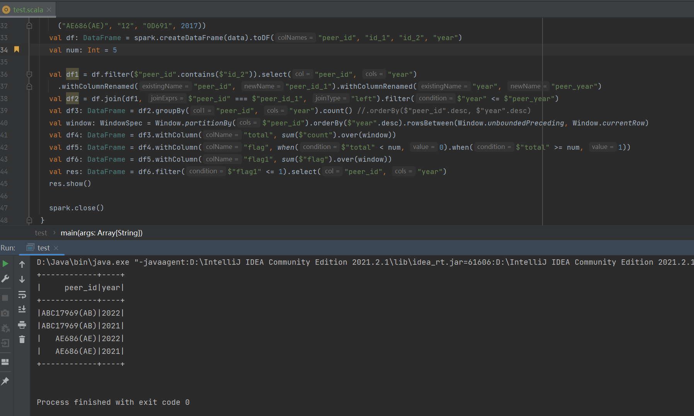
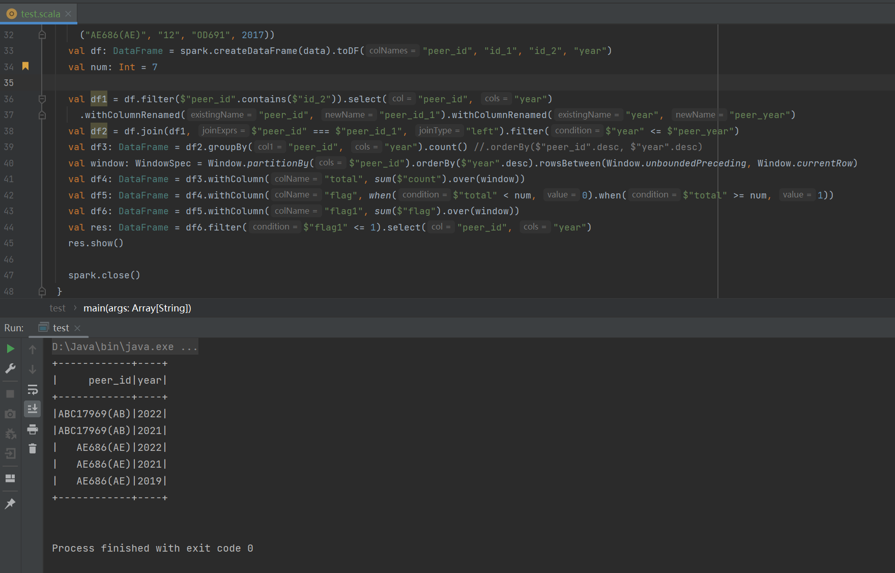

# Spark Scala test

Implement code:

```scala
package bigdata.spark_sql

import org.apache.spark.sql.expressions.{Window, WindowSpec}
import org.apache.spark.sql.{DataFrame, SparkSession}
import org.apache.spark.sql.functions._
import org.apache.spark.{SparkConf, SparkContext}


object test {

  def main(args: Array[String]): Unit = {
    val sparkConf: SparkConf = new SparkConf().setMaster("local[*]").setAppName("SparkSql")
    val sc = new SparkContext(sparkConf)
    val spark: SparkSession = SparkSession.builder().config(sparkConf).getOrCreate()
    import spark.implicits._


    val data = Seq(("ABC17969(AB)", "1", "ABC17969", 2022),
      ("ABC17969(AB)", "2", "CDC52533", 2022),
      ("ABC17969(AB)", "3", "DEC59161", 2023),
      ("ABC17969(AB)", "4", "F43874", 2022),
      ("ABC17969(AB)", "5", "MY06154", 2021),
      ("ABC17969(AB)", "6", "MY4387", 2022),
      ("AE686(AE)", "7", "AE686", 2022),
      ("AE686(AE)", "8", "BH2740", 2021),
      ("AE686(AE)", "9", "EG999", 2021),
      ("AE686(AE)", "10", "AE0908", 2023),
      ("AE686(AE)", "11", "QA402", 2022),
      ("AE686(AE)", "12", "OA691", 2022),
      ("AE686(AE)", "12", "OB691", 2022),
      ("AE686(AE)", "12", "OC691", 2019),
      ("AE686(AE)", "12", "OD691", 2017))
    val df: DataFrame = spark.createDataFrame(data).toDF("peer_id", "id_1", "id_2", "year")
    val num: Int = 7

    val df1 = df.filter($"peer_id".contains($"id_2")).select("peer_id", "year")
      .withColumnRenamed("peer_id", "peer_id_1").withColumnRenamed("year", "peer_year")
    val df2 = df.join(df1, $"peer_id" === $"peer_id_1", "left").filter($"year" <= $"peer_year")
    val df3: DataFrame = df2.groupBy("peer_id", "year").count() //.orderBy($"peer_id".desc, $"year".desc)
    val window: WindowSpec = Window.partitionBy($"peer_id").orderBy($"year".desc).rowsBetween(Window.unboundedPreceding, Window.currentRow)
    val df4: DataFrame = df3.withColumn("total", sum($"count").over(window))
    val df5: DataFrame = df4.withColumn("flag", when($"total" < num, 0).when($"total" >= num, 1))
    val df6: DataFrame = df5.withColumn("flag1", sum($"flag").over(window))
    val res: DataFrame = df6.filter($"flag1" <= 1).select("peer_id", "year")
    res.show()

    spark.close()
  }
}

```

# test result:

when give number is 5



when give number is 5

